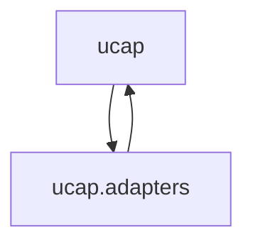

# System map

Generated 2026-05-14 by regen-map. Do not hand-edit.

## Modules

| Module | Purpose | Status |
|---|---|---|
| [ucap](../../src/ucap/MODULE.md) | TODO — retrofit skeleton; please fill in. | |
| [ucap.adapters](../../src/ucap/adapters/MODULE.md) | TODO — retrofit skeleton; please fill in. | |

## Dependency graph



> Note: Both modules currently declare each other under **Depends on** (the package consumes adapter outputs via `cli.py`; adapters consume `CanonicalUeCapability` and the Literal type aliases from `schema.py`). This is a known cycle pending architecture-phase clean-up — likely resolved by either (a) moving the shared schema into the future `diagnostics`/`schema` leaf module, or (b) declaring one direction as the "official" edge and the other as a fixture-time / dispatch-time call. Flagged for the architecture session; do not paper over.

## Project File Structure

_Alphabetical, regenerated by regen-map. Directory descriptions come from MODULE.md Purpose; file descriptions come from the per-language description-source rule in structure-conventions.md._

```
ucap/
├── CLAUDE.md
├── README.md
├── STATUS.md
├── docs/
│   └── compact/
│       ├── DECISIONS.md
│       ├── MAP.md
│       ├── PROJECT.md
│       ├── STATUS.md
│       ├── phases/
│       │   ├── architecture.md
│       │   ├── development.md
│       │   └── requirements.md
│       ├── project-init-interview.md
│       ├── requirements.md
│       ├── retrofit-snapshot.md
│       ├── strands/
│       │   └── _archive/
│       └── structure-conventions.md
├── pyproject.toml
├── src/
│   └── ucap/                                  # TODO — retrofit skeleton; please fill in.
│       ├── MODULE.md
│       ├── __init__.py
│       ├── adapters/                          # TODO — retrofit skeleton; please fill in.
│       │   ├── MODULE.md
│       │   ├── __init__.py
│       │   ├── elt.py                         # MediaTek ELT (Engineer Log Tool) adapter — stub.
│       │   ├── qcat.py                        # QCAT log text parser and canonical mapper.
│       │   └── shannon.py                     # Samsung Shannon DM (Exynos) log adapter — stub.
│       ├── cli.py                             # Command-line entry point.
│       └── schema.py                          # Canonical schema for UE capability band combinations.
└── tests/
    ├── __init__.py
    ├── fixtures/
    │   └── qcat/
    │       ├── ATTRIBUTION.md
    │       ├── G960W_LTE.txt
    │       ├── OnePlus9_LTE.txt
    │       ├── OnePlus9_NR.txt
    │       ├── S22_LTE.txt
    │       └── S22_NR.txt
    └── test_qcat.py                           # Tests for the QCAT adapter against vendored sample fixtures.
```
