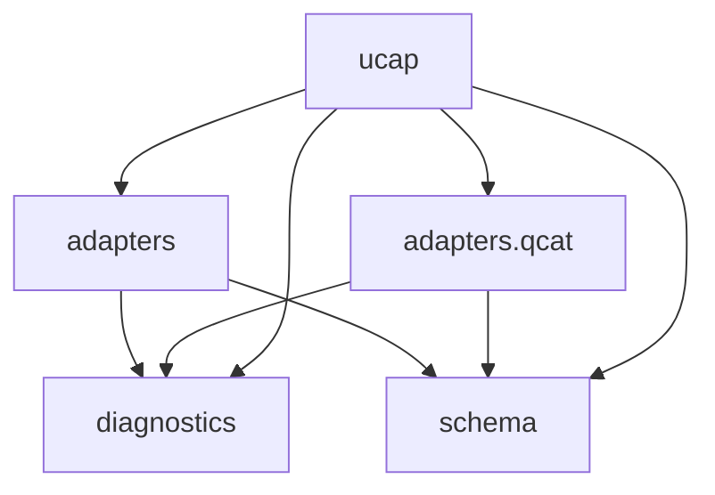

# System map

Generated 2026-05-14 by regen-map. Do not hand-edit.

## Modules

| Module | Purpose | Status |
|---|---|---|
| [ucap](../../src/ucap/MODULE.md) | The user-facing top-level package: hosts the `ucap` console-script CLI (subcommand-style dispatcher) and the package version. | |
| [ucap.adapters](../../src/ucap/adapters/MODULE.md) | Umbrella module for per-vendor parsers that map chipset-vendor modem-log text exports to `CanonicalUeCapability` records — one record per `UE Capability Information` message in the input. | |
| [ucap.adapters.qcat](../../src/ucap/adapters/qcat/MODULE.md) | Per-vendor parser for QCAT (Qualcomm Chipset Analyzer Toolkit) text exports of `UE Capability Information` messages. | |
| [ucap.diagnostics](../../src/ucap/diagnostics/MODULE.md) | Owns the chat-mediated debugging vocabulary for ucap: error-code registry, three compact report types (RPT / MET / QC), and the fixed-field QC template machinery. | |
| [ucap.schema](../../src/ucap/schema/MODULE.md) | Canonical schema for UE capability band combinations — Pydantic v2 models with `extra="forbid"` and the Literal type aliases (`Vendor`, `Release`, `RatName`, etc.) that every adapter and the CLI share. | |

## Dependency graph



Graph is acyclic. `D-014` resolved the prior `ucap ↔ adapters` cycle via the schema split; `D-018` promotes qcat to a sub-module without introducing a new cycle.

## Project File Structure

_Alphabetical, regenerated by regen-map. Directory descriptions come from MODULE.md Purpose; file descriptions come from the per-language description-source rule in structure-conventions.md._

```
ucap/
├── CLAUDE.md
├── README.md
├── STATUS.md
├── docs/
│   └── compact/
│       ├── DECISIONS.md
│       ├── MAP.md
│       ├── PROJECT.md
│       ├── STATUS.md
│       ├── phases/
│       │   ├── architecture.md
│       │   ├── development.md
│       │   └── requirements.md
│       ├── project-init-interview.md
│       ├── requirements.md
│       ├── retrofit-snapshot.md
│       ├── strands/
│       │   └── _archive/
│       └── structure-conventions.md
├── pyproject.toml
├── src/
│   └── ucap/                                  # The user-facing top-level package: hosts the `ucap` console-script CLI (subcommand-style dispatcher) and the package version.
│       ├── MODULE.md
│       ├── __init__.py
│       ├── adapters/                          # Umbrella module for per-vendor parsers that map chipset-vendor modem-log text exports to `CanonicalUeCapability` records — one record per `UE Capability Information` message in the input.
│       │   ├── MODULE.md
│       │   ├── __init__.py
│       │   ├── elt.py                         # MediaTek ELT (Engineer Log Tool) adapter — stub.
│       │   ├── qcat/                          # Per-vendor parser for QCAT (Qualcomm Chipset Analyzer Toolkit) text exports of `UE Capability Information` messages.
│       │   │   ├── MODULE.md
│       │   │   ├── __init__.py                # QCAT adapter — auto-dispatches between indented tree and ASN.1 value notation formats.
│       │   │   └── _indented.py               # QCAT log text parser and canonical mapper.
│       │   └── shannon.py                     # Samsung Shannon DM (Exynos) log adapter — stub.
│       ├── cli.py                             # Command-line entry point.
│       ├── diagnostics/                       # Owns the chat-mediated debugging vocabulary for ucap: error-code registry, three compact report types (RPT / MET / QC), and the fixed-field QC template machinery.
│       │   ├── MODULE.md
│       │   └── __init__.py                    # Diagnostics: error codes and compact report types for chat-mediated debugging.
│       └── schema/                            # Canonical schema for UE capability band combinations — Pydantic v2 models with `extra="forbid"` and the Literal type aliases (`Vendor`, `Release`, `RatName`, etc.) that every adapter and the CLI share.
│           ├── MODULE.md
│           └── __init__.py                    # Canonical schema for UE capability band combinations.
└── tests/
    ├── __init__.py
    ├── fixtures/
    │   └── qcat/
    │       ├── ATTRIBUTION.md
    │       ├── G960W_LTE.txt
    │       ├── OnePlus9_LTE.txt
    │       ├── OnePlus9_NR.txt
    │       ├── S22_LTE.txt
    │       └── S22_NR.txt
    ├── test_diagnostics.py                    # Tests for the diagnostics module (D-009 / D-011 / D-012 / D-013).
    └── test_qcat.py                           # Tests for the QCAT adapter against vendored sample fixtures.
```
